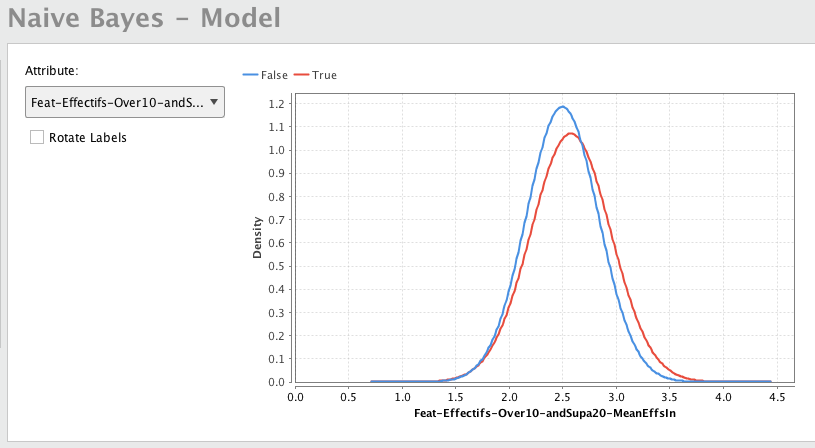
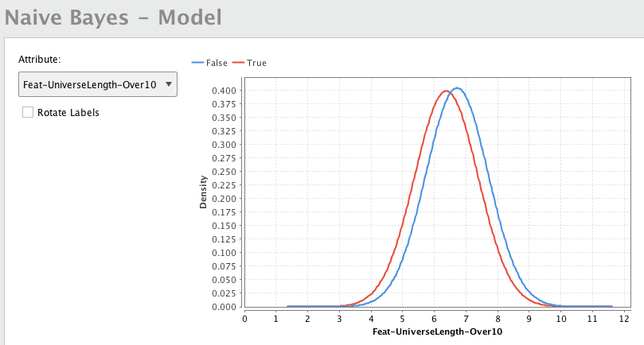
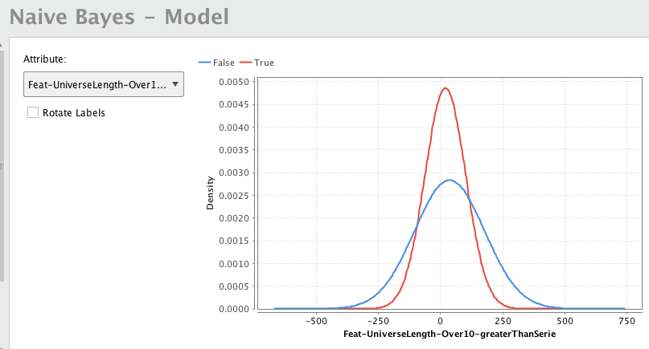
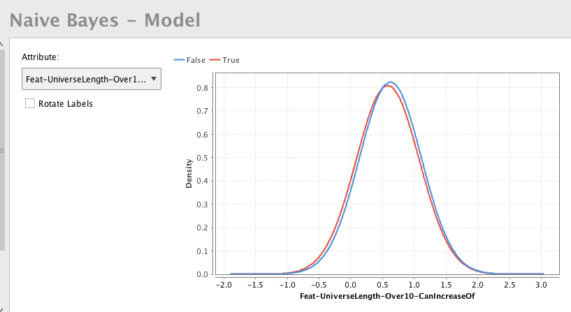

# Lofea
Lottery features for use in machine learning algorithms or data analysis

Examples
--------
Take a look at the examples folder.
You will find results of how the features generated could give better insights to players.

### How do the features perform ?

TLDR: my own results
> By using a *slight variation of this*, I was able to correctly predict 2 times a group of 3 balls (out of 10) of [Trio Magic](https://jeux.loro.ch/games/magic3) that contained the drawn middle number (2018). Thanks to that lottery earnings distribution, I was able to play tickets with all three numbers whithout ever loosing money. Basically, 1 winning ticket out of 3 was sufficient to *break even* (my goal). Better yet I still had a chance to win the jackpot.
> 
> In order to *play all combinations offered by the prediction* and claim the jackpot, I had to play roughly 300 tickets (that would have netted to 0 loss). Unfortunately, my student self was short on time (and $).
> 
> Other thing to note, I only played when the features were *all pointing* toward the given output. Such convergence of features only happened rarely. They occured in a 3-4 months interval the two times I played.
> 
> Other note, I tried a 3rd time to predict 3 numbers to see if it could be a generalized working winning algorithm (that time I did not buy any ticket, just checking prediction) but it failed. So current success rate is 2 / 3.

**Theoretical results**

Using [Rapid Miner](http://rapidminer.com)'s *Auto Model* tool, a sample *Naive Bayes* model was created to 
see how the features can be distinguished from one another, which may lead to the ability to increase the
potential of predictions.

The data used to train and test the model were generated using draw histories of `1/10` lotteries, like [*TrioMagic*](https://jeux.loro.ch/games/magic3) (Switzerland) and [*Joker+*](https://www.loterie-nationale.be/nos-jeux/joker-plus/resultats-tirage) (Belgium).

**The goal** was to predict whether the next ball would belong to a certain group (like we would try to predict the parity of the next draw). Hence, **the target to predict was reduced to a binary output**, which allowed me to try a classifier for this task. Here are the results of how each feature's correlation with each output class (represented in the graph by the `True` and `False` classes).

This graph shows us that this feature has a **slightly different distribution** *depending on the class of the output to predict*.

Here after, a feature with a distribution that that appeared to have a different distribution depending on the output class. This shows some correlation between the feature and the output. Even though it is known fact that *correlation does not mean causation*, it is still something worth noting.

..., where as other features do not show a lot of distinction between the classes.

So such features would be deemed irrelevant when trying to predict that output.

All in all, these graphs and results show that some features could be meaningfull when trying to predict whether or not the *universe length* would increase (which would point us to a group of symbols we might prefer to play for higher probabilities of winning).

**See the [example's README](examples/RapidMiner-featuresUpdater-Ulen-willIncrease-prediction/README.md) for more explainations**.

### Contact / Contributing

*Feal free to open an issue* if you have any questions or to contact me regarding this project.
