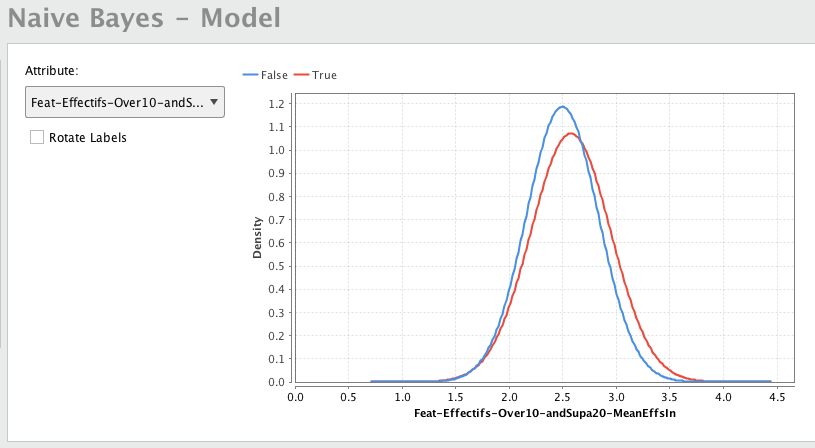
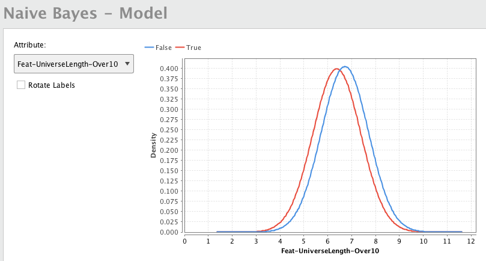
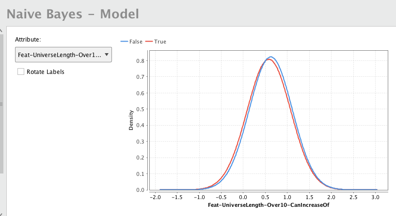

[TOC]

### Approach and Features

This set of examples demonstrates the results obtained regarding the prediction lottery numbers.

Practically, the approach taken was to predict not the numbers themselves, but rather predict from which group a number was most likely to be drawn.

The groups where built by looking at a specific feature. For instance, just as we could have grouped odd number apart from even numbers and try  to predict the parity of the next lottery number, I decided to group them using a feature I called "*Universe length*", which will be described further down.

As an aside, some features are only suited for some types of lotteries and can hardly be applied when the lottery type is different. For instance, with lotteries where only 1 symbol is drawn from a different pool (like the swiss TrioMagic[^triomagic]), we can try to predict the parity of the next symbol, where as for lotteries of type like 6/49, we would have to adapt and instead try to predict how many even numbers might be in the next draw.
There are also some features that can **only** be applied to lotteries of type 1/N.

#### Feature - **Universe length**

"Universe" here refers to the french terminology of a "sample space" in the probability theory.

What is this feature?

It is a feature meant only for lotteries of type 1/N (meaning pick 1 symbol from a pool of N symbols). The values of this feature are integers bounded within the interval [1; N].
The feature requires a parameter K, with the simplest one being K = N, like in a 1/10 lottery, K=10.
The value of the feature is simply the size of the sample space composed of the last K drawn symbols.

When looking a 1/10 lottery, we can look at the latest 10 drawn symbols and count how many different ones there are. If the last draw results are [1,4,3,4,5,1,5,9,0,0], then we would have 6 different symbols and the size of this sample space would be 6. With a draw history of [7,8,9,7,8,9,7,8,9,7], then the *universe length* would be 3.

This feature allows us to see periods in time when drawn symbols tend to repeat a lot or if they are very well distributed. All this at a simple glance. In the examples above, when the universe length is 3, we know that a lot of symbols have been repeated recently and one might then wonder if it would be wiser to play a number that is *not* in 7,8 or 9 since this group appeared a lot.

### Results obtained

The following graphs were generated with the *RapidMiner 8*'s *AutoModel* functionality. A machine learning model was generated and we looked at feature importance and how each feature affected the prediction.

The feature we tried to predict was: **will the *universe length* take the highest value it can in the next draw** ?
True: usually means that a symbol outside of the current "*universe*" will be drawn,
False: usually means that the 

For instance, if the latest 10 draws were [1,7,1,5,4,1,4,4,9,7] universe is {1,4,5,7,9} which has a length (or size) of 5. It will increase to 6 if the next drawn number is within {0,2,3,6,8} but will decrease if the next symbol is one of {1,4,5,7,9}. In which case "True" means the length will increase to 6.

The data used to train and test the model were generated using draw histories of 1/10 lotteries, like TrioMagic (Switzerland) and Joker+ (Belgium).
The graphs and results show that some features could be meaningfull when trying to predict whether or not the *universe length* would increase (which would point us to a group of symbols we might prefer to play for higher probabilities of winning).

..., where as other features do not show a lot of distinction between the classes.

[^triomagic]: 3 pools of numbers ranging from 0 to 9. Example draws: 007, 123, 555, ... More details on the [website](https://jeux.loro.ch/games/magic/triomagic/summary)

